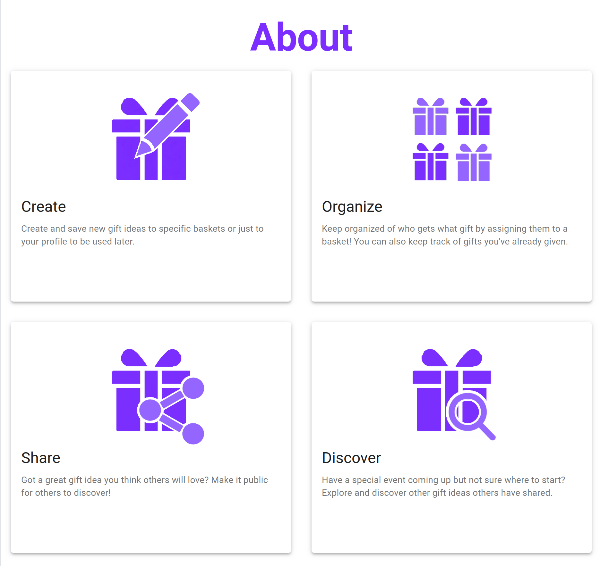
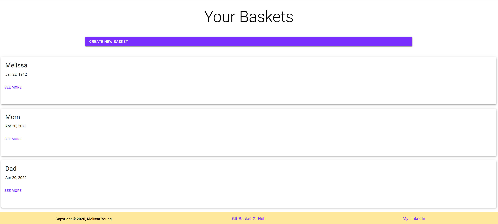
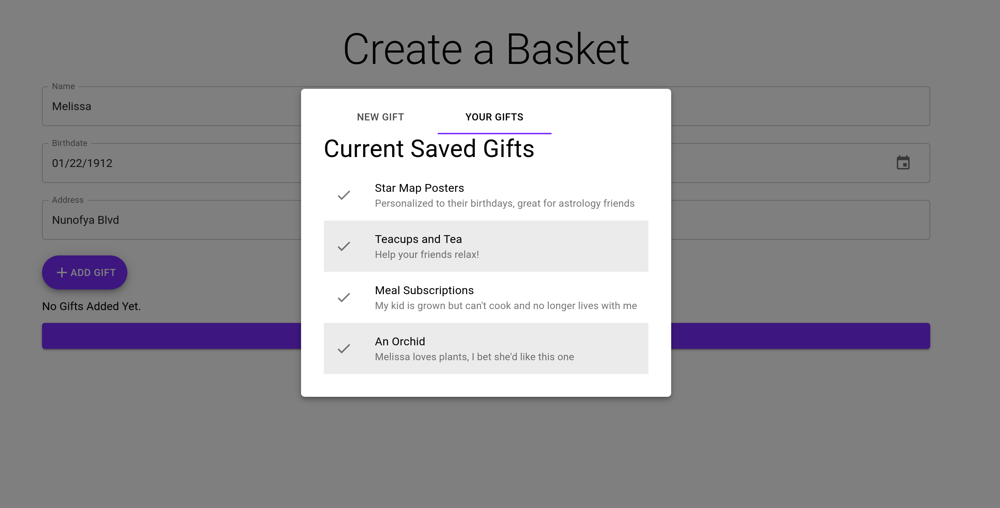
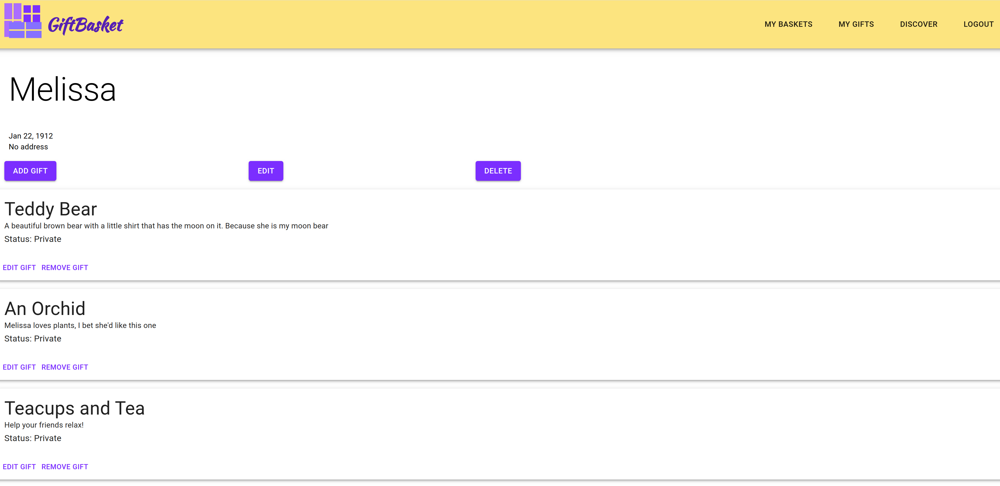
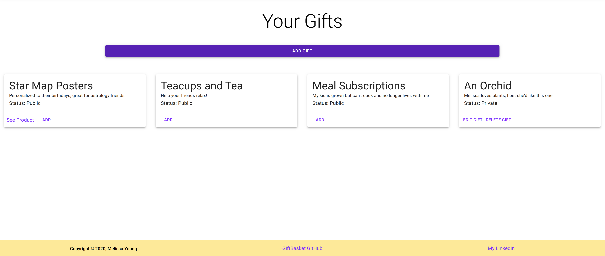

## Elevator Pitch
Progressive Web Application allowing users to create and save different gift ideas for their friends in order to have a list to reference during special moments in those friends lives.

## User Stories
- User always sees or thinks of good gift ideas for their loved ones, but never remember them when it's actually their birthday or a holiday. They use GiftBasket to capture those ideas in the moment to reference later.

## Wireframes
  [Link to Wireframes](https://docs.google.com/document/d/1uI1vH5dAborPAwI2L5a398Vu8ILIg24JS4x4jlzkrrY/edit?usp=sharing)
- Landing Page - Create an account / Sign In
- Home Page - View all the different "baskets" that you've created (A basket is made per person you add to your profile)
- Create a Basket page - Takes in a name, birthdate, maybe an address and any primary gift ideas
- View Basket page - See a specific basket and everything in it. Can remove ideas from here, and add gift ideas.
- Edit Basket - Edit details about the person.
- User Profile page 
- Edit User Profile page

## Proposed Architecture
- Backend in Express, Sequelize, Postgres
- I want to use GraphQL and Apollo for my query language
- Use the Cloudinary API to save photos
- Frontend in React, TypeScript, with making it a PWA using create-react-app as the base
- Material UI since I'm making it a PWA

## MVP
- Queries and mutations for GraphQL set up with the backend - *Completed* 
- Auth using Bcrypt for create account and login - *Completed*
- Able to create baskets and add/remove ideas - *Completed*

### Stretch goal: 
- I'd love to create a feed page for sharing gift ideas that everyone can see. - *Completed*
- I want to create and integrate a chrome extension to help make it easier to save things to your baskets without having to switch tabs and such.

### Screenshots from Project:
###### Landing Page

###### About Section

###### Basket List

###### Create Basket

###### Basket Page

###### Discover Gifts

###### User's Gift List

### Moving Forward:
- Make sure it's mobile friendly, and switch it to a PWS
- Implement an API such as cloudinary for image uploading
- Create the chrome extension that will allow users to save ideas without being logged in.

## Resources
[Tutorial for Graphql and Sequelize](https://andela.com/insights/using-graphql-and-sequelize/)

[Stock Background Photo - Landing Page](https://www.google.com/url?sa=i&url=https%3A%2F%2Fideas.ted.com%2Fhow-we-turned-our-familys-holiday-gift-exchange-into-a-chance-to-really-connect%2F&psig=AOvVaw0_z4tNV7xP2LU2_-SqWoNu&ust=1586404278178000&source=images&cd=vfe&ved=0CAIQjRxqFwoTCMDD8c321-gCFQAAAAAdAAAAABAH)
